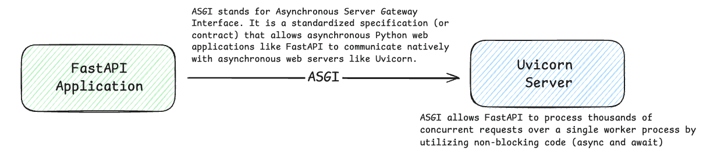

## Overview 

This project uses Python and FastAPI to build a microservices-based architecture, demonstrating how independently deployable services operate within Kubernetes. It explores container orchestration, service discovery, horizontal scaling, load balancing, and cloud-native deployment patterns to showcase how applications can scale dynamically and remain resilient in modern cloud environments.

In this section, we will briefly explore FastAPI and understand how it fits into a modern microservices ecosystem. We will start by understanding the underlying technologies that power FastAPI—ASGI, Uvicorn, and Starlette—and how they work together to handle asynchronous requests, concurrency, and high-performance API workloads. From there, we will see how FastAPI can be structured and deployed as independent microservices and integrated into a scalable, cloud-native architecture.

  

