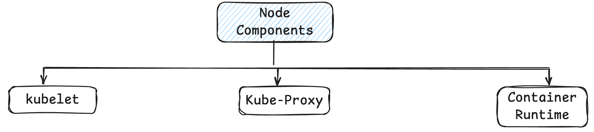
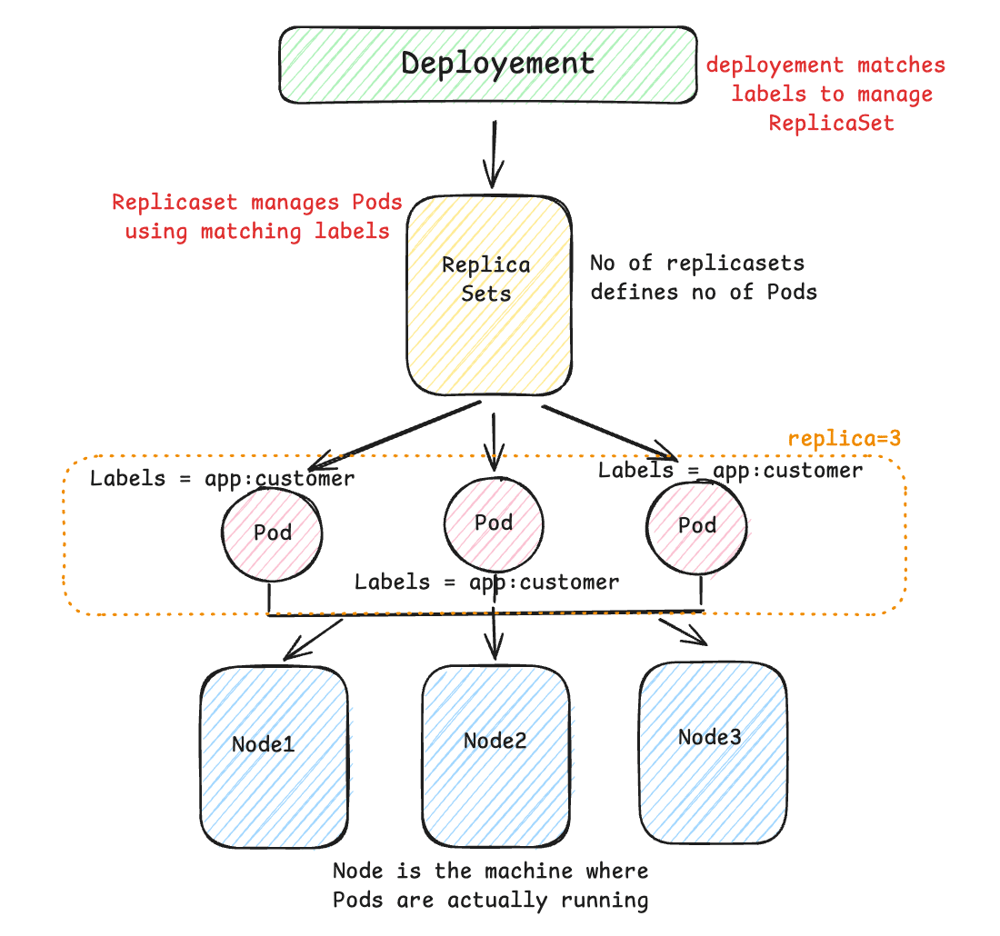

## Kubernetes Core Concepts 

Kubernetes is CNCF graduated project developed from Google and now open-sourced widely used in the world for better performance and other things.

## 1.0 Cluster Archictecture

A Kubernetes cluster consists of a control plane plus a set of worker machines, called nodes, that run containerized applications. Every cluster needs at least one worker node in order to run Pods.

<p align="center">
  
</p>

### 1.1 Cluster Components 

<p align="center">
  
</p>

#### 1.1.1 Kubernetes API Server

The **Kubernetes API Server (`kube-apiserver`)** is the central entry point and frontend of the Kubernetes control plane. It exposes the Kubernetes API through which users, administrators, `kubectl`, controllers, schedulers, and other Kubernetes components interact with the cluster.

The API Server is responsible for **validating and processing API requests**, performing authentication and authorization, applying admission controls, and persisting the cluster's desired state in **etcd**. Other control-plane components communicate with the cluster primarily through the API Server rather than directly accessing etcd.

The API Server is designed to be **horizontally scalable**. Multiple API Server instances can run behind a load balancer, allowing Kubernetes to handle higher request volumes and providing **high availability and fault tolerance**. Since the API Server is largely stateless, multiple instances can serve requests concurrently while sharing the same etcd data store.

In a simplified architecture:

`kubectl / Clients → Load Balancer → Multiple kube-apiserver instances → etcd`

The API Server is therefore the **communication hub of the Kubernetes control plane**, providing a consistent and secure interface for managing and observing the entire cluster.


#### 1.1.2 etcd Cluster Ccomponent

**etcd** is a distributed, strongly consistent **key-value store** that Kubernetes uses as the persistent backing store for the **cluster's control-plane state**. It stores critical information about the cluster, including the desired and current state of Kubernetes resources such as Pods, Deployments, Services, ConfigMaps, Secrets, and other objects.

The **Kubernetes API Server** is the primary component that interacts with etcd. When you create or modify a Kubernetes resource through `kubectl` or the Kubernetes API, the API Server validates the request and persists the resulting state in etcd.

A simplified flow is:

`kubectl → kube-apiserver → etcd`

Because etcd contains the Kubernetes cluster's critical state, **losing etcd data can result in the loss of the cluster's configuration and state**. Therefore, in production environments, etcd should be deployed with high availability and protected with a robust backup and disaster-recovery strategy.

It is important to regularly create and securely store **etcd snapshots**, ideally outside the cluster or in durable external storage. These backups can be used to restore the Kubernetes control-plane state in case of data corruption, accidental deletion, infrastructure failure, or disaster.

In a highly available Kubernetes control plane, multiple etcd members typically form a cluster and use consensus to maintain a consistent copy of the data:

```text
              kube-apiserver
                     │
                     ▼
              ┌─────────────┐
              │    etcd     │
              │   Cluster   │
              └─────────────┘
                │     │     │
                ▼     ▼     ▼
             etcd-1 etcd-2 etcd-3
```

The key takeaway is:

> **etcd is the durable source of truth for Kubernetes cluster state. Protecting it with high availability, regular snapshots, secure backup storage, and tested disaster-recovery procedures is critical for production Kubernetes clusters.**

#### 1.1.3 Kube Scheduler

The **Kubernetes Scheduler (`kube-scheduler`)** is a core control-plane component responsible for deciding **which worker node should run a newly created Pod**. It does not create or manage the Pod itself; instead, it watches for Pods that have been created but do not yet have a node assigned and selects the most suitable node for them.

The scheduling process typically involves two main stages:

1. **Filtering:** The scheduler eliminates nodes that cannot run the Pod based on constraints such as available CPU and memory, resource requests, node selectors, affinity/anti-affinity rules, taints, and tolerations.

2. **Scoring:** Among the remaining eligible nodes, the scheduler evaluates and scores them based on various scheduling preferences and selects the best candidate.

Once a node is selected, the scheduler assigns the Pod to that node by updating its scheduling decision through the Kubernetes API Server. The **kubelet running on the selected node** then takes responsibility for actually starting and managing the Pod's containers.

A simplified flow is:

```text
User / Controller
       │
       ▼
Kubernetes API Server
       │
       ▼
Pod Created
       │
       ▼
Pod has no assigned Node
       │
       ▼
kube-scheduler
       │
       ├── Filter unsuitable nodes
       │
       ├── Score eligible nodes
       │
       └── Select best node
       │
       ▼
API Server records node assignment
       │
       ▼
kubelet on selected Node
       │
       ▼
Starts and manages Pod
```

For example, if a Pod requests **2 CPU cores and 4 GB of memory**, the scheduler considers whether nodes have sufficient allocatable resources before placing the Pod. It can also consider more advanced constraints, such as ensuring replicas are distributed across different nodes or avoiding specific nodes.

The key distinction is:

> **The kube-scheduler decides where a Pod should run; the kubelet on that node is responsible for running and managing the Pod.**

This separation of responsibilities allows Kubernetes to efficiently distribute workloads across the cluster while respecting resource requirements, placement rules, and scheduling policies.


#### 1.1.4 Kube Controller-Manager

##### Understanding Controllers

Before diving into the **Kubernetes Controller Manager**, it's important to understand what a **controller** is.

A **controller** is a control loop that continuously watches the current state of the Kubernetes cluster through the Kubernetes API Server and compares it with the **desired state** defined by the user. Whenever it detects a difference between the two, it automatically takes corrective actions to bring the current state back to the desired state.

For example, if a Deployment specifies **3 replicas** but only **2 Pods** are currently running because one crashed, the responsible controller detects this discrepancy and creates a new Pod to restore the desired state.

```text
Desired State: 3 Pods
        │
        ▼
Current State: 2 Pods
        │
        ▼
Controller detects mismatch
        │
        ▼
Creates a new Pod
        │
        ▼
Current State: 3 Pods ✅
```

This continuous reconciliation process is known as the **reconciliation loop**, and it is one of the fundamental principles of Kubernetes. Instead of requiring administrators to manually monitor and recover resources, controllers constantly work in the background to ensure the cluster converges toward the declared desired state.

---

The **kube-controller-manager** is a core component of the Kubernetes control plane that **hosts and runs multiple built-in controllers**. Rather than being a single controller, it acts as a manager process that continuously executes numerous reconciliation loops, with each controller responsible for a specific type of Kubernetes resource.

Some of the most important controllers managed by the Controller Manager include:

* **Deployment Controller** – Ensures Deployments maintain the desired number of ReplicaSets and Pods.
* **ReplicaSet Controller** – Keeps the specified number of Pod replicas running.
* **Node Controller** – Monitors node health and handles node failures.
* **Job Controller** – Manages one-time batch workloads until completion.
* **CronJob Controller** – Creates Jobs according to a defined schedule.
* **Namespace Controller** – Cleans up resources when a namespace is deleted.
* **Service Account Controller** – Creates and manages default service accounts.
* **EndpointSlice Controller** – Maintains endpoint information for Services.

A simplified architecture is:

```text
                kube-controller-manager
                          │
        ┌─────────────────┼─────────────────┐
        │                 │                 │
        ▼                 ▼                 ▼
 Deployment        ReplicaSet        Node Controller
 Controller         Controller
        │                 │
        └───────────┬─────┘
                    │
                    ▼
          Watch Current State
                    │
                    ▼
      Compare with Desired State
                    │
                    ▼
          Reconcile Differences
```

The key idea is:

> **Controllers continuously reconcile the cluster's current state with its desired state, while the `kube-controller-manager` is the component that runs and manages these controllers, enabling Kubernetes to automatically heal, recover, and maintain the cluster without manual intervention.**

#### 1.1.5 Cloud Controller Manager (cloud-controller-manager)

The **Cloud Controller Manager (CCM)** is a Kubernetes control-plane component that allows Kubernetes to integrate with the APIs and infrastructure services of a specific **cloud provider**. It separates cloud-provider-specific logic from the core Kubernetes control plane, allowing Kubernetes to run consistently across different cloud environments.

The Cloud Controller Manager runs cloud-specific controllers that communicate with the cloud provider's APIs to manage and monitor resources outside the Kubernetes cluster.

For example, when running Kubernetes on a cloud platform, the Cloud Controller Manager may be responsible for:

* **Node Controller** – Detects and monitors nodes provided by the cloud platform and determines whether a node is still available.
* **Route Controller** – Manages network routes required for Pod-to-Pod communication, depending on the cloud provider's networking model.
* **Service Controller** – Integrates Kubernetes `Service` resources of type `LoadBalancer` with the cloud provider's load-balancing infrastructure.
* **Cloud Provider Integration** – Allows Kubernetes to interact with cloud-specific infrastructure such as load balancers, networking components, and other provider-managed resources.

For example, when you create:

```yaml
apiVersion: v1
kind: Service
metadata:
  name: my-service
spec:
  type: LoadBalancer
```

The flow can conceptually look like:

```text
Kubernetes Service
        │
        ▼
Kubernetes API Server
        │
        ▼
Cloud Controller Manager
        │
        ▼
Cloud Provider API
        │
        ▼
Cloud Load Balancer Created
        │
        ▼
External Traffic
        │
        ▼
Kubernetes Service
        │
        ▼
Pods
```

The important distinction is that the **Cloud Controller Manager does not manage all Kubernetes resources**. Its primary responsibility is to handle the parts of Kubernetes that require **cloud-provider-specific integration**.

For example:

```text
Core Kubernetes Logic
        │
        ├── kube-controller-manager
        │       └── Generic Kubernetes controllers
        │
        └── cloud-controller-manager
                └── Cloud-provider-specific controllers
                        │
                        ├── Node integration
                        ├── Load Balancers
                        └── Cloud networking/routes
```

The key idea is:

> **The Cloud Controller Manager acts as the bridge between Kubernetes and the underlying cloud infrastructure, running cloud-specific controller logic so that Kubernetes can integrate with services such as load balancers, networking, and cloud-managed nodes without embedding provider-specific logic directly into the core Kubernetes components.**

The exact controllers and responsibilities can vary depending on the cloud provider and its Kubernetes integration. Modern Kubernetes environments often use **out-of-tree cloud controller managers**, where cloud-specific code is maintained separately from the Kubernetes core, making the platform easier to evolve and support across different cloud providers.

## 2.0 Node Components

<p align="center">
  
</p>

#### 2.1 kubelet
The kubelet is the primary Kubernetes agent that runs on every node. Its main responsibility is to ensure that the Pods assigned to its node are running and healthy according to their declared configuration.

The kubelet communicates with the Kubernetes API Server to obtain information about Pods scheduled to its node. It then works with the container runtime to create, start, stop, and monitor the containers required by those Pods.

The kubelet does not schedule Pods. The kube-scheduler decides which node a Pod should run on, and once the Pod is assigned to a node, the kubelet on that node takes responsibility for running it.

The simplified flow is:

                    kube-scheduler
                          │
                          │ Selects Node
                          ▼
                   Kubernetes API Server
                          │
                          │ Pod assigned
                          ▼
                    kubelet on Node
                          │
                          │ Requests container runtime
                          ▼
                   Container Runtime
                          │
                          ▼
                    Starts Containers
                          │
                          ▼
                         Pod

The kubelet continuously monitors the Pods under its responsibility. If a container crashes and the Pod's restart policy allows it, the kubelet works with the container runtime to restart the container.

#### 2.2 Container Runtime

The Container Runtime is the software responsible for actually running containers on a Kubernetes node.

Kubernetes itself does not directly execute containers. Instead, the kubelet communicates with a container runtime through the Container Runtime Interface (CRI).

Common Kubernetes-compatible runtimes include:

containerd
CRI-O

Historically, Docker Engine was commonly used with Kubernetes, but modern Kubernetes does not directly use Docker Engine as a CRI runtime. Instead, runtimes such as containerd or CRI-O are commonly used.


#### 2.3 kube-proxy

The kube-proxy is a node-level networking component that helps implement the networking behavior associated with Kubernetes Service resources.

A Kubernetes Service provides a stable virtual endpoint for accessing a group of Pods.

## 3.0 K8s Terminologies and High Level Overview 

<p align="center">
  
</p>