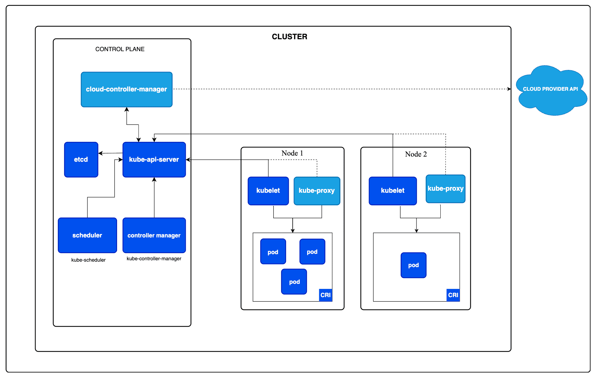
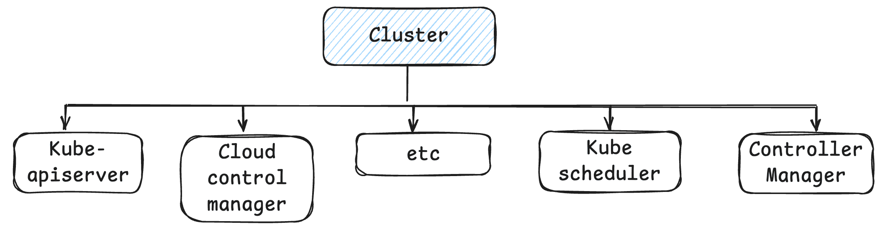

## Kubernetes Core Concepts 

Kubernetes is CNCF graduated project developed from Google and now open-sourced widely used in the world for better performance and other things.

## 1.0 Cluster Archictecture

A Kubernetes cluster consists of a control plane plus a set of worker machines, called nodes, that run containerized applications. Every cluster needs at least one worker node in order to run Pods.

<p align="center">
  
</p>

### 1.1 Cluster Components 

<p align="center">
  
</p>

#### 1.1.1 Kubernetes API Server

The **Kubernetes API Server (`kube-apiserver`)** is the central entry point and frontend of the Kubernetes control plane. It exposes the Kubernetes API through which users, administrators, `kubectl`, controllers, schedulers, and other Kubernetes components interact with the cluster.

The API Server is responsible for **validating and processing API requests**, performing authentication and authorization, applying admission controls, and persisting the cluster's desired state in **etcd**. Other control-plane components communicate with the cluster primarily through the API Server rather than directly accessing etcd.

The API Server is designed to be **horizontally scalable**. Multiple API Server instances can run behind a load balancer, allowing Kubernetes to handle higher request volumes and providing **high availability and fault tolerance**. Since the API Server is largely stateless, multiple instances can serve requests concurrently while sharing the same etcd data store.

In a simplified architecture:

`kubectl / Clients → Load Balancer → Multiple kube-apiserver instances → etcd`

The API Server is therefore the **communication hub of the Kubernetes control plane**, providing a consistent and secure interface for managing and observing the entire cluster.


#### 1.1.1 etcd Cluster Ccomponent

**etcd** is a distributed, strongly consistent **key-value store** that Kubernetes uses as the persistent backing store for the **cluster's control-plane state**. It stores critical information about the cluster, including the desired and current state of Kubernetes resources such as Pods, Deployments, Services, ConfigMaps, Secrets, and other objects.

The **Kubernetes API Server** is the primary component that interacts with etcd. When you create or modify a Kubernetes resource through `kubectl` or the Kubernetes API, the API Server validates the request and persists the resulting state in etcd.

A simplified flow is:

`kubectl → kube-apiserver → etcd`

Because etcd contains the Kubernetes cluster's critical state, **losing etcd data can result in the loss of the cluster's configuration and state**. Therefore, in production environments, etcd should be deployed with high availability and protected with a robust backup and disaster-recovery strategy.

It is important to regularly create and securely store **etcd snapshots**, ideally outside the cluster or in durable external storage. These backups can be used to restore the Kubernetes control-plane state in case of data corruption, accidental deletion, infrastructure failure, or disaster.

In a highly available Kubernetes control plane, multiple etcd members typically form a cluster and use consensus to maintain a consistent copy of the data:

```text
              kube-apiserver
                     │
                     ▼
              ┌─────────────┐
              │    etcd     │
              │   Cluster   │
              └─────────────┘
                │     │     │
                ▼     ▼     ▼
             etcd-1 etcd-2 etcd-3
```

The key takeaway is:

> **etcd is the durable source of truth for Kubernetes cluster state. Protecting it with high availability, regular snapshots, secure backup storage, and tested disaster-recovery procedures is critical for production Kubernetes clusters.**
