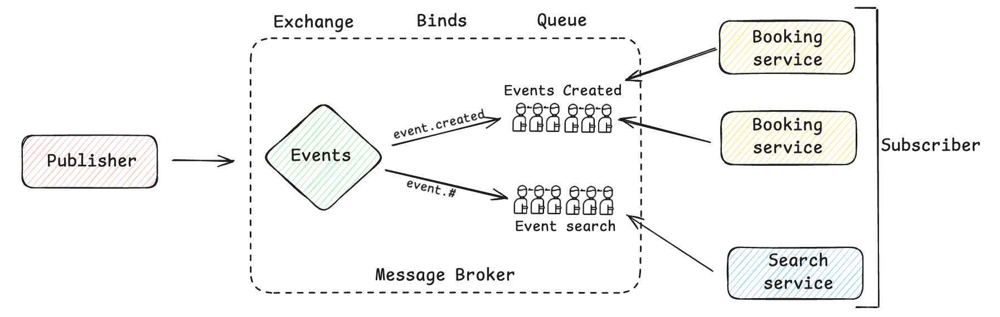

# RabbitMQ in Eventra — Concepts, Patterns & Production Notes

> Companion to `infra/rabbitmq.go`. It currently uses the AMQP **default exchange** (`""`): queues are declared by name, and messages route to the queue whose name equals the routing key.

## 1. AMQP 0-9-1: Exchanges, Queues, Bindings

```
Publisher ──► Exchange ──binding──► Queue ──► Consumer
                 ▲                     ▲
                 │            (holds messages)
        routing key        binding key = routing key
```

- **Exchange** — where publishers send messages (`channel.Publish(exchange, routingKey, ...)`). It does *not* store messages.
- **Queue** — a named FIFO buffer that stores messages until consumed.
- **Binding** — a rule linking an exchange to a queue, matching a routing/binding key. A message only reaches a queue if a binding matches.

### The default exchange (`""`)
Every VHost has a pre-declared exchange called `""`. Its rule is implicit: **the routing key must equal the queue name**. There is nothing to declare — the binding exists by convention. The current code publishes and consumes with the queue name directly, so no explicit binding is ever created.

### Q1 — Is binding performed by the consumer?
**Binding is a separate, declarative step, not a runtime part of publish or consume.** Who performs it is a design choice:

- **Consumer-declares-topology (most common)** — the consuming app declares the exchange, queue, and binding at startup with `QueueBind(queue, key, exchange, ...)`. Declarations are **idempotent**, so it's safe for many instances to do this at boot. This is the recommended pattern because the consumer knows what it needs.
- **Provisioning/infra-as-code** — topology declared once via the management API, Terraform, or a bootstrap script.
- **Publisher-declares** — less common; only safe for fanout/exclusive setups.

The default exchange in `infra/rabbitmq.go` has an *implicit* binding, which is why there's no `QueueBind` call today. When you move to named exchanges (`topic`, `fanout`, `direct`), you'll add explicit `ch.QueueBind(queue, key, exchange, false, nil)` — almost always on the **consumer** side.

## 2. Connection & Channel Management (Q2)

### Publisher side
- Open **one long-lived TCP connection** per process; never per message. `amqp.Dial` is the expensive handshake.
- Multiplex **many lightweight channels** over that connection. Channels carry the actual `Publish`/`Consume` operations.
- RabbitMQ's official guidance: **don't share one channel across concurrent goroutines** — open a channel per goroutine/worker. The current code keeps a single channel; fine for low volume, but concurrent HTTP handlers can interleave on it.

### Consumer side
- Same model: one connection, one **dedicated channel per consumer** (each consumer goroutine gets its own channel + its own prefetch window).
- Acknowledge from the same channel that delivered the message.

### Broker side
- **Heartbeats** (AMQP-level keepalive, default ~60s in RabbitMQ) detect dead peers; tune via `amqp.Config{Heartbeat: ...}`.
- The broker enforces **connection/channel limits**, applies TCP backpressure, and can go into **flow control** under memory/disk pressure (alarms).
- Closing order matters: **close the channel before the connection** (the current `Close()` does this correctly).

### What the current code does
`NewRabbitMQ` dials once (with a 5-attempt boot retry) and opens one channel. That covers **startup ordering** under docker-compose, but not **runtime failures** — see §4.

## 3. Best Practices (Q3)

1. **One long-lived connection per app; many channels.** Share the connection, not channels.
2. **Declare topology idempotently at consumer startup** (exchange → queue → binding).
3. **Durable queues + persistent delivery** for messages that must survive restarts (`DeliveryMode: amqp.Persistent`). Current `Publish` sends `text/plain` non-persistent.
4. **Use publisher confirms** (`ch.Confirm()` + `NotifyPublish`) so you know the broker accepted a message before trusting it. Not enabled in the current code.
5. **Manual acks + prefetch (QoS).** Set `ch.Qos(prefetch, 0, false)` and `autoAck=false`, then `d.Ack()` after successful processing. ⚠️ The current `Consume` uses `autoAck=true` — a crash mid-processing loses the message.
6. **Handle poison messages** — `d.Nack(false, false)` (don't requeue) and route to a **dead-letter exchange (DLX)**. Consider `x-message-ttl`, `x-max-length` on queues.
7. **Idempotent consumers.** Delivery is at-least-once; duplicates are possible, so key processing on a message ID.
8. **Backoff + reconnect** for both producers and consumers (see §4).
9. **Never declare transient state in hot paths** — declarations belong at startup.
10. **Close resources with `defer`; graceful shutdown** (stop consuming → drain → close channel → close connection).

## 4. Production Readiness (Q4)

**Resilience**
- The current 5-attempt retry happens *once at boot*. Production needs a **reconnect loop** watching `conn.NotifyClose` / `ch.NotifyClose`, with **exponential backoff + jitter**, re-declaring topology on reconnect.
- Use a connection name (`amqp.Config{Properties: ...}`) for debugging in the management UI.

**Delivery guarantees**
- **Publisher confirms** → at-least-once from producer.
- **Persistent messages + durable queues** → survive broker restart.
- **Manual ack + prefetch** → at-least-once from consumer.
- Combine with **idempotency keys** to get effectively-once business semantics.

**High availability**
- RabbitMQ **cluster**; prefer **Quorum Queues** (replicated, Raft) over mirrored classic queues. Producers/consumers point at a load-balanced/endpoint list of nodes.

**Observability**
- Management plugin (HTTP API), **Prometheus** metrics (queue depth, unacked count, publish/consume rates), alert on queue age/length, connection drop rates.
- Structured logging + trace/message IDs across the pipeline.

**Security**
- `amqps://` TLS, **VHost isolation** per service, least-privilege users, secrets from env/secret managers — **not** in `config.json`.

**Configuration**
- Connection URL from environment (`RABBITMQ_URL`), validated at startup, overridable per environment.

**Graceful shutdown**
- On SIGTERM: cancel consumers → wait for in-flight acks (drain) → `Close()` (channel, then connection).

## 5. Gap analysis — current code vs production

| Concern | `infra/rabbitmq.go` today | Production should |
|---|---|---|
| Connection reuse | One long-lived conn ✅ | — |
| Channel per goroutine | Single shared channel ⚠️ | Dedicated channel per worker |
| Boot retry | 5 attempts with backoff ✅ | Also **runtime reconnect** with `NotifyClose` |
| Queue durability | `durable=true` ✅ | — |
| Auto-ack | `autoAck=true` ⚠️ | Manual acks + prefetch |
| Publisher confirms | none ⚠️ | `Confirm` + `NotifyPublish` |
| Persistent delivery | `text/plain`, non-persistent ⚠️ | `DeliveryMode: Persistent`, JSON |
| Named exchanges / bindings | default exchange only | Declare exchange + `QueueBind` (consumer) |
| DLX / TTL / max-length | no queue args ⚠️ | Set in `QueueDeclare` args |
| TLS / auth | plain `amqp://` | `amqps://` + least-privilege user |
| Graceful shutdown | `defer Close` only | Drain consumers on SIGTERM |

## 6. Production-grade sketch (for reference)

```go
// one connection shared across the service
conn := mustConnect(amqpURL)            // + NotifyClose reconnect loop (backoff)
defer conn.Close()

// publisher: dedicated channel, confirms on
pubCh, _ := conn.Channel()
pubCh.Confirm()
confirms := pubCh.NotifyPublish(make(chan amqp.Confirmation, 1))
pubCh.Publish("events.topic", "event.created", false, false, amqp.Publishing{
    ContentType:  "application/json",
    DeliveryMode: amqp.Persistent,
    Body:         payload,
})
if !<-confirms { /* retry */ }

// consumer: dedicated channel, QoS, manual acks
ch, _ := conn.Channel()
ch.Qos(10, 0, false)                 // prefetch
_ = ch.QueueBind("events.q", "event.*", "events.topic", false, nil)
deliveries, _ := ch.Consume("events.q", "", false, false, false, false, nil)
for d := range deliveries {
    if err := process(d.Body); err != nil {
        d.Nack(false, false)         // don't requeue poison message
        continue
    }
    d.Ack(false)                     // at-least-once
}
```


## Points to Ponder 

- If you publish directly to a queue using the default exchange (""), you don't explicitly create a binding.RabbitMQ's default exchange has an implicit routing rule where the queue name acts as the routing key.

<p align="center">
  
</p>

- Another Point from here